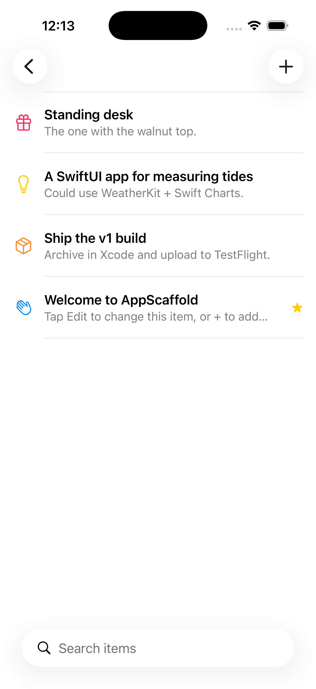
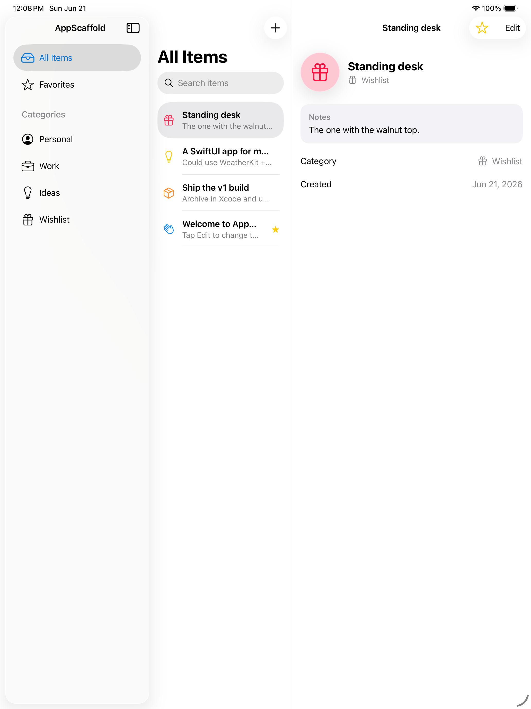

# ios-dev — a Claude Code skill for native iOS & iPadOS apps


A [Claude Code](https://claude.com/claude-code) **skill** that makes Claude an expert at building polished, modern **native iPhone & iPad apps** — Swift + SwiftUI + SwiftData on the current iOS 26 stack. It ships a deeply‑researched reference library, a buildable starter project, and a scaffold script, so Claude produces apps that use today's idioms (Liquid Glass, the Observation framework, Swift 6 concurrency, Foundation Models) instead of stale patterns from its training data.

> **What's a skill?** A folder Claude Code loads on demand — a `SKILL.md` playbook plus reference docs, scripts, and assets. This one is invoked with `/ios-dev`. See Anthropic's [Agent Skills docs](https://docs.claude.com/en/docs/claude-code/skills).

---

## Screenshots

The bundled starter (`AppScaffold`) running on the iOS 26 Simulator — an adaptive iPhone + iPad app built from this skill, compiled and tested green:

| iPhone — searchable list, Liquid Glass controls | iPad — adaptive split view |
|:--:|:--:|
|  |  |

---

## What it gives you

- **Current, correct idioms.** `@Observable` (not `ObservableObject`), `NavigationStack`/`NavigationSplitView`, the value‑based `Tab` API, SwiftData, Swift 6.2 "Approachable Concurrency," and the **Liquid Glass** design system — all version‑qualified for what actually ships in iOS 26 vs. what's pre‑GA in iOS 27.
- **A buildable starter,** not a snippet. One command stamps out a renamed, polished iPhone+iPad app that compiles, runs, and has passing tests.
- **Depth on demand.** 18 focused reference files covering everything from navigation to widgets to on‑device AI to App Store shipping — Claude reads only what a task needs.
- **Honesty about dates.** Every version claim is fact‑checked against Apple's primary docs and carries its source, so you can trust (and re‑verify) it.

## Coverage

UI & layout · Liquid Glass · navigation · state/Observation · SwiftData & CloudKit · Swift 6 concurrency & networking · iPad windowing & multitasking · widgets / App Intents / Live Activities / Control Center · on‑device Apple Intelligence (Foundation Models, Writing Tools, Image Playground, Visual Intelligence) · StoreKit 2 in‑app purchases · MapKit / HealthKit / Swift Charts / PhotosUI & other system frameworks · design & accessibility · gestures & haptics · Swift Testing & debugging · performance · privacy manifests · App Store submission · Xcode 26 tooling & the third‑party library landscape.

---

## Prerequisites

To **use the skill** (let Claude read it and write code), you only need Claude Code. To **build and run** what it produces, you need an Apple development setup.

**Required**

| | |
|---|---|
| **Claude Code** | Any recent version. The skill is invoked explicitly with `/ios-dev` (it does not auto‑activate). |
| **A Mac** | Apple silicon recommended, running **macOS Tahoe 26.2 or later** (required to run Xcode 26). |
| **Full Xcode 26+** | With the **iOS 26 SDK**. The iPhone/iPad **Simulator is bundled** inside Xcode. ⚠️ **Command Line Tools alone are not enough** — they have the Swift compiler but no iOS SDK or Simulator, so you can edit code but cannot build or run an app. Xcode is a large (~30 GB+) free download from the Mac App Store or [developer.apple.com](https://developer.apple.com/xcode/). |
| **Python 3** | For the scaffold script. Preinstalled on macOS. |

**Optional / situational**

| | |
|---|---|
| **XcodeGen** | `brew install xcodegen`. Used by the scaffold script to generate the `.xcodeproj` from `project.yml`. Without it you can still create the project manually in Xcode. |
| **Apple Developer account** | Free tier is fine. Needed only to run on a **physical device** and to test some entitlements — **not** for Simulator work. |
| **Apple‑Intelligence‑capable device** | To test the **Foundation Models** / on‑device AI features: iPhone 15 Pro or later, any iPhone 16+, or an M1+ iPad/Mac, with Apple Intelligence enabled. These features **do not run in the Simulator**. |

> **Build SDK vs. minimum iOS:** the App Store has required builds made with the **iOS 26 SDK (Xcode 26+) since April 28, 2026** — but your app's *minimum* iOS version is independent. You can still deploy to older devices (iOS 18, etc.) and guard iOS 26‑only APIs with `if #available(iOS 26, *)`.

---

## Install

Claude Code discovers skills in `~/.claude/skills/`. Clone this repo there:

```bash
git clone https://github.com/<you>/ios-dev-skill.git ~/.claude/skills/ios-dev
```

…or add it as a submodule / copy the folder in. Restart Claude Code (or start a new session) and confirm it appears with `/ios-dev`.

**Project‑scoped install:** drop the folder at `.claude/skills/ios-dev/` inside a repo to make it available only there. **Plugin distribution:** the same folder can be packaged in a Claude Code plugin's `skills/` directory.

---

## Usage

### Let Claude drive it

Invoke the skill and describe what you want — Claude reads `SKILL.md`, picks the right references, scaffolds, builds, and verifies:

```
/ios-dev build me an iPhone + iPad app for tracking houseplants,
with watering reminders and iCloud sync
```

It works even if you never say "iOS" or "SwiftUI" — *"make me an app for my phone that…"* triggers the same path.

### Scaffold a project yourself

```bash
python3 ~/.claude/skills/ios-dev/scripts/new_ios_app.py "MyApp" \
    --bundle-id com.yourco.myapp \
    --dest ~/Developer/MyApp

cd ~/Developer/MyApp && open MyApp.xcodeproj   # pick an iPhone or iPad simulator, Run
```

Flags: `--bundle-id` (default `com.example.<AppName>`), `--dest` (default `./<AppName>`), `--no-generate` (skip `xcodegen`), `--force` (overwrite). See [`assets/templates/AppScaffold/README.md`](assets/templates/AppScaffold/README.md).

---

## What's inside

```
ios-dev/
├── SKILL.md                       # the playbook Claude reads first
├── README.md                      # this file
├── references/                    # 18 focused, on-demand deep dives
├── scripts/
│   └── new_ios_app.py             # scaffold a renamed copy of the starter
├── assets/templates/AppScaffold/  # the buildable starter project (XcodeGen)
└── docs/screenshots/              # images used by this README
```

### The reference library (`references/`)

| File | Covers |
|---|---|
| `project-setup.md` | Xcode/SDK, the SDK mandate vs deployment target, Swift 6.2 build settings, permissions, privacy manifest, the Simulator's limits |
| `app-structure.md` | App/Scene, `NavigationStack`/`NavigationSplitView`, the `Tab` API, multi‑window, deep links, state restoration |
| `swiftui-views.md` | Views, the layout system, lists & scrolling, animation, SF Symbols |
| `liquid-glass.md` | Adopting the Liquid Glass design system on custom UI |
| `state-observation.md` | `@Observable`/Observation, `@Environment`/`@Entry`, data‑flow architecture |
| `data-persistence.md` | SwiftData, schema migration, CloudKit sync, Core Data, files |
| `concurrency-and-networking.md` | Swift 6 concurrency (actors, `@MainActor`, `@concurrent`), async/await, URLSession |
| `ipad.md` | The iPadOS 26 windowing system, multitasking, pointer/keyboard/Pencil, drag‑and‑drop, Catalyst |
| `system-integration.md` | WidgetKit, App Intents, Live Activities / Dynamic Island, Control Center controls, Spotlight |
| `apple-intelligence.md` | The Foundation Models framework, Writing Tools, Image Playground, Genmoji, Visual Intelligence |
| `monetization-storekit.md` | In‑app purchases & subscriptions (StoreKit 2), paywalls, external purchase / EU distribution |
| `frameworks.md` | MapKit, HealthKit, Swift Charts, PhotosUI, AVFoundation, Core Location, TipKit, WeatherKit & more |
| `design-and-accessibility.md` | HIG & Liquid Glass craft, typography, color, app icon, accessibility, localization |
| `interaction.md` | Gestures, haptics, text input, search, context menus, scroll interactions |
| `testing-and-debugging.md` | Swift Testing, Previews, Instruments, logging |
| `performance-and-shipping.md` | SwiftUI performance, privacy manifests, App Store Connect, TestFlight, distribution |
| `tooling-and-ecosystem.md` | Xcode 26 AI features, SPM, swift‑format, CI, and which third‑party libraries to use (or skip) |
| `versions-and-sources.md` | iOS 17→18→26→27 change tables and the primary‑source citation index |

### The starter template (`assets/templates/AppScaffold/`)

A small but real iPhone + iPad app that demonstrates the modern stack end‑to‑end:

- An adaptive **`NavigationSplitView`** (sidebar → list → detail on iPad; collapses to push navigation on iPhone)
- **SwiftData** persistence with a dynamic, predicate‑driven `@Query`
- **Liquid Glass** (free on standard controls; explicit on a tinted glass badge + a `.glassProminent` button)
- `.searchable`, swipe actions, `ContentUnavailableView`, `.symbolEffect`, a clean create/edit sheet
- **Swift 6.2** main‑actor‑by‑default concurrency (no `Sendable` ceremony in UI code)
- A **Swift Testing** suite (including a parameterized test)

It's driven by [XcodeGen](https://github.com/yonyz/XcodeGen): edit `project.yml`, not the generated `.xcodeproj`.

---

## How it's built (and kept accurate)

This skill was produced by a research‑then‑verify pipeline rather than written from memory:

1. **Research** — many parallel agents swept Apple's current documentation, the WWDC 2025 & 2026 sessions, the HIG, and Apple Newsroom, capturing version‑qualified facts with source URLs.
2. **Adversarial fact‑check** — the most "datable" claims (current OS/Xcode/Swift versions, framework APIs, deprecations) were independently verified against primary Apple sources. That pass corrected several things general‑purpose models get wrong (e.g. SF Symbols version, deprecated AI APIs, the two separate concurrency build settings).
3. **Build verification** — the starter was compiled, unit‑tested, and run on the iPhone 17 and iPad Pro simulators. Doing so surfaced and fixed real bugs (iOS `List(selection:)` requires an optional binding; in‑memory `ModelContainer` test helpers must keep the container alive; test targets need `import Foundation` for `#Predicate`; generic `@Model` names like `Category` collide under `import Foundation`). Each fix is also documented as a pitfall in the references.

**Currency:** the content is dated **2026‑06‑21** (the week after WWDC 2026). iOS 26 is treated as shipping; iOS 27 material is clearly labeled pre‑GA.

## Keeping it current

iOS changes every September. After each WWDC / major OS release, refresh the skill:

1. **Re‑date `references/versions-and-sources.md`** — bump the shipping version, move newly‑shipped APIs from "pre‑GA" to shipping, and record the new pre‑GA wave.
2. **Spot‑check the high‑traffic references** (Liquid Glass, app structure, Apple Intelligence, SwiftData, concurrency) against the new SDK and WWDC sessions.
3. **Re‑run the starter** through the new Xcode/Simulator to catch breakage; update the template and screenshots if the UI shifts.

Every factual change should cite an Apple primary source.

---

## Caveats & disclaimers

- **The content is dated and iOS moves every season.** This snapshot is **2026‑06‑21** (the week after WWDC 2026). Treat version‑specific facts as a point‑in‑time reference and **refresh after each WWDC** (see [Keeping it current](#keeping-it-current)).
- **iOS 27 content is pre‑release.** WWDC 2026 APIs may be renamed or cut before they ship in fall 2026; the references label these and tell you to verify against the final SDK. **Don't ship App Store builds made with the Xcode 27 / iOS 27 beta SDK** — they're rejected.
- **macOS + Xcode only.** You cannot build or run iOS apps on Windows or Linux, and **Command Line Tools alone won't do** — you need full Xcode (see [Prerequisites](#prerequisites)). Claude can scaffold and edit code anywhere, but verifying it (compile/test/run) requires a Mac with Xcode.
- **On‑device AI needs real Apple‑Intelligence hardware.** The Foundation Models framework and related features don't run in the Simulator and are absent on older devices — always check `SystemLanguageModel.default.availability` and provide a non‑AI fallback.
- **Generated code is a starting point, not a finished product.** Review it, test it, and confirm it builds before relying on it. The skill is an expert assistant, not an oracle — re‑confirm time‑sensitive and pre‑GA details against Apple's live documentation before you ship.
- **Apple's docs are JavaScript‑rendered.** A plain HTTP fetch often returns only a page title; the skill notes when to use a rendered scrape or the context7 MCP to read them.
- **The skill is user‑invoked.** It's marked `disable-model-invocation`, so it activates only when you call `/ios-dev` (or run the scaffold script) — it won't trigger itself on an unrelated message.
- **Not affiliated with or endorsed by Apple.** Apple, iOS, iPadOS, SwiftUI, SwiftData, Xcode, Liquid Glass, SF Symbols, App Store, and related marks are trademarks of Apple Inc. This is an independent, community resource.

## Contributing

Issues and PRs welcome. The highest‑value contributions are **post‑WWDC refreshes** (re‑date `versions-and-sources.md`, move newly‑shipped APIs from pre‑GA to shipping) and corrections backed by an Apple primary source. Please cite the source URL in any change to a factual claim.

## License

No license is set yet — add one before publishing (MIT is a common, permissive choice for developer tooling). Note the trademark disclaimer above regardless of the code license you choose.
